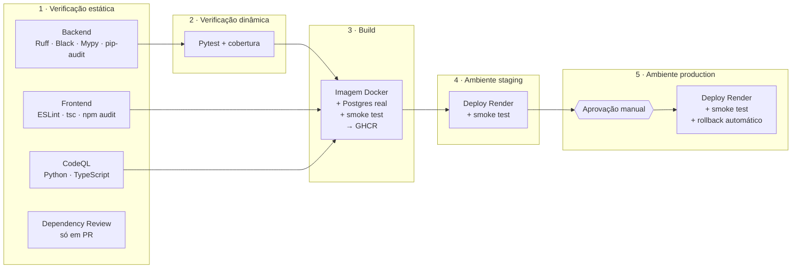

# 🚀 Pipeline de CI/CD e deploy do Finix

Este documento explica a pipeline definida em [`.github/workflows/ci-cd.yml`](../.github/workflows/ci-cd.yml)
e traz o passo a passo (feito **uma única vez**) para ligar o deploy automático.

---

## 1. Visão geral

| Quando | O que roda |
|---|---|
| **Pull request** | Estágios 1–3. Nada é publicado; serve para barrar código ruim antes do merge. |
| **Push na `main`** | Todos os estágios. A imagem é publicada, vai para **staging** automaticamente e para **production** após aprovação. |
| **Manual** (`Run workflow`) | Igual ao push na `main`. |

### Como a pipeline atende aos critérios da atividade

| Critério | Onde está |
|---|---|
| **Jobs necessários para subir em produção** | `backend-static`, `frontend-static`, `codeql`, `dependency-review`, `backend-tests`, `build`, `deploy-staging`, `deploy-production` |
| **Comandos em cada job** | Cada `step` com `run:` (ex.: `ruff check`, `pytest --cov`, `docker run`, `smoke-test.sh`) |
| **Verificação estática** (ferramentas do GitHub Actions) | Ruff, Black, Mypy, ESLint, `tsc`, **CodeQL** (`github/codeql-action`), **Dependency Review** (`actions/dependency-review-action`), `pip-audit`, `npm audit` |
| **Verificação dinâmica** | Pytest com cobertura (relatório como artefato + resumo no job), migrations aplicadas e revertidas num **Postgres real** (service container), **smoke test** do container e dos ambientes publicados |
| **Pelo menos 2 ambientes** | GitHub Environments **`staging`** e **`production`**, cada um com seus próprios secrets, URL e regras de proteção |

### Decisões de projeto (bons pontos para a apresentação)

- **Build once, deploy many.** A imagem é construída uma vez (`ghcr.io/isadora-yasmim/finix:sha-<commit>`)
  e a *mesma* imagem é promovida de staging para production. O que foi testado é exatamente o que vai para o ar.
- **Uma imagem, uma origem.** A imagem de produção (`Dockerfile` na raiz) compila o frontend e o serve pela
  própria API. Frontend e backend ficam no mesmo domínio: sem CORS entre domínios e o cookie de refresh
  (`SameSite=Lax`) funciona sem gambiarra.
- **Configuração em tempo de execução.** A imagem é igual nos dois ambientes; o que muda são as variáveis
  de ambiente (`DATABASE_URL`, `SECRET_KEY`, `ENVIRONMENT`...) definidas no Render.
- **O smoke test confirma o commit.** `/health/version` devolve o commit da imagem; a pipeline só considera o
  deploy concluído quando o ambiente está servindo *aquele* commit.
- **Rollback automático.** Após cada deploy bem-sucedido em production, a imagem recebe a tag `production`.
  Se o smoke test de um deploy novo falhar, a pipeline reimplanta essa última versão boa.
- **Menor privilégio.** O `GITHUB_TOKEN` é só leitura por padrão; cada job pede apenas o que precisa
  (`packages: write`, `security-events: write`...).

> 🐛 **A pipeline já pagou o próprio custo.** Ao testar as migrations num Postgres real, apareceu um bug que os
> testes (em SQLite) não pegavam: a migration `0002` apontava para uma revisão `0001` que não existia — o
> `alembic upgrade head` quebraria no primeiro deploy. Foi corrigido e agora há um teste (`test_migrations.py`)
> e um passo na pipeline que impedem isso de voltar.

---

## 2. Infraestrutura (camadas gratuitas)

| Peça | Serviço | Por quê |
|---|---|---|
| Registro de imagens | **GitHub Container Registry** (GHCR) | Já vem com o GitHub; a pipeline publica com o `GITHUB_TOKEN`. |
| Hospedagem | **Render** — 2 Web Services (staging e production) | Plano Free roda imagens Docker e aceita *Deploy Hooks*. |
| Banco | **Neon** (Postgres 16 serverless) — 2 branches (staging e production) | Plano Free permanente; branches isolam os dados de cada ambiente. |

> ⚠️ No plano Free do Render o serviço **hiberna após 15 min sem acesso** e leva ~1 min para acordar.
> O smoke test já espera por isso (até 10 min). Antes de apresentar, abra as URLs para "acordar" os serviços.

> 🔒 Estas instâncias são públicas: **não suba extratos reais** nelas. O plano do projeto continua sendo
> local-first/self-host para dados de verdade — aqui é a vitrine da primeira versão.

---

## 3. Passo a passo (uma vez só)

### 3.1 Banco no Neon

1. Crie uma conta em <https://neon.tech> e um projeto **`finix`** (Postgres 16, região **AWS US East (N. Virginia)** — a mesma do Render, para as consultas não cruzarem o continente).
2. A branch padrão (`main`/`production`) será o banco de **production**. Copie a *connection string*.
3. Em **Branches → New branch**, crie **`staging`** e copie a *connection string* dela também.

As URLs vêm como `postgresql://...?sslmode=require` — pode colar como estão; o backend troca o driver sozinho.

### 3.2 Primeira imagem no GHCR

1. Faça o merge deste PR na `main`. A pipeline roda os estágios 1–3 e **publica a imagem**.
   Os jobs de deploy aparecem como *skipped* — ainda não estão habilitados (é esperado).
2. No GitHub, abra seu perfil → **Packages → finix → Package settings → Change visibility → Public**.
   (Assim o Render consegue baixar a imagem sem credencial.)
3. Anote a tag publicada, visível na página do pacote: `ghcr.io/isadora-yasmim/finix:sha-<commit>`.

### 3.3 Dois serviços no Render

Crie uma conta em <https://render.com> e, **para cada ambiente**, faça:

1. **New → Web Service → Existing Image** → cole a imagem do passo anterior.
2. Nome: `finix-staging` (e depois `finix` para production). Instance type: **Free**. Região: **Virginia (US East)**.
3. **Environment Variables:**

   | Variável | staging | production |
   |---|---|---|
   | `DATABASE_URL` | URL da branch `staging` do Neon | URL da branch principal do Neon |
   | `SECRET_KEY` | valor aleatório* | **outro** valor aleatório* |
   | `ENVIRONMENT` | `staging` | `production` |
   | `COOKIE_SECURE` | `true` | `true` |
   | `BACKEND_CORS_ORIGINS` | `https://finix-staging.onrender.com` | `https://finix.onrender.com` |

   \* Gere com `python -c "import secrets; print(secrets.token_urlsafe(32))"`.

4. **Health Check Path:** `/health`. Crie o serviço e aguarde o primeiro deploy (ele já roda as migrations).
5. Em **Settings → Deploy Hook**, copie a URL (é secreta — quem tem a URL consegue fazer deploy).

> As URLs finais podem ter um sufixo (ex.: `finix-ab12.onrender.com`) se o nome já existir — use as que o Render mostrar.

### 3.4 Ambientes no GitHub

Em **Settings → Environments** do repositório:

**`staging`**
- *Environment secrets* → `RENDER_DEPLOY_HOOK_URL` = Deploy Hook do `finix-staging`
- *Environment variables* → `APP_URL` = `https://finix-staging.onrender.com`

**`production`**
- *Environment secrets* → `RENDER_DEPLOY_HOOK_URL` = Deploy Hook do `finix`
- *Environment variables* → `APP_URL` = `https://finix.onrender.com`
- *Deployment protection rules* → marque **Required reviewers** e adicione você mesma
- *Deployment branches and tags* → **Selected branches** → `main`

Por fim, em **Settings → Secrets and variables → Actions → Variables**, crie a variável de repositório
**`DEPLOY_ENABLED` = `true`**.

### 3.5 Primeiro deploy pela pipeline

1. **Actions → CI/CD → Run workflow** (branch `main`).
2. Staging é implantado sozinho; acompanhe o smoke test no log.
3. O job **Deploy · Production** fica aguardando: clique em **Review deployments → production → Approve and deploy**.
4. No fim, o resumo da execução mostra o commit e a URL de produção. 🎉

Opcional: crie a tag da primeira versão — `git tag v0.1.0 && git push origin v0.1.0` — ou uma *Release* pela interface.

---

## 4. Roteiro de apresentação (≈5 min)

1. Abra o `ci-cd.yml` e mostre os 5 estágios pelos comentários de cabeçalho.
2. **Actions → execução mais recente**: mostre o grafo dos jobs (estáticos em paralelo → testes → build → staging → production).
3. Abra o job de testes: resumo de cobertura + artefato com relatórios.
4. **Security → Code scanning**: alertas do CodeQL.
5. **Settings → Environments**: dois ambientes, secrets separados, aprovação obrigatória em production.
6. Abra `https://<staging>/health/version` e `https://<production>/health/version` — o commit bate com o da execução.
7. Mostre um PR: a pipeline roda estágios 1–3 e o *Dependency Review*, sem publicar nada.

---

## 5. Operação

| Situação | O que fazer |
|---|---|
| Deploy em production falhou no smoke test | A pipeline já reimplanta a tag `production` (última versão boa). Veja o log do job. |
| Voltar manualmente para uma versão | Render → serviço → *Manual Deploy → Deploy an existing image* → escolha uma tag `sha-...` do GHCR. |
| Pausar deploys automáticos | Mude `DEPLOY_ENABLED` para `false`. CI continua rodando normalmente. |
| Ver a versão no ar | `GET /health/version` |
| Rodar a imagem de produção localmente | `docker build -t finix . && docker run -p 8000:8000 -e DATABASE_URL=... finix` |
